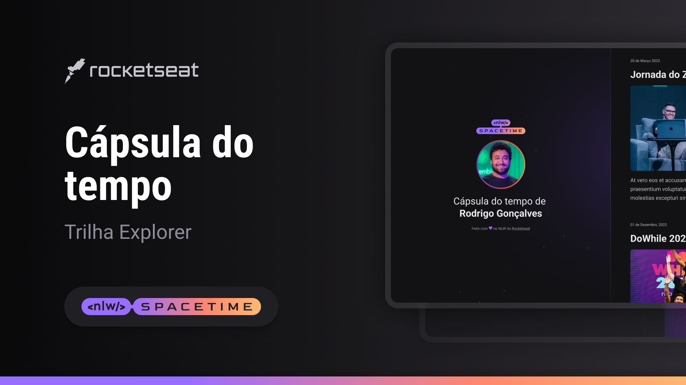

## 🖥️ Projeto
Esse é um projeto Web Responsivo de uma cápsula do tempo para exibir memórias em uma linha do tempo.

## 👨‍💻 Tecnologias

- HTML
- CSS
- GIT E Github

## 🧛🏻 Layout
Você pode visualizar o layout do projeto [aqui](https://www.figma.com/file/WLzLduryWtncMK52Pri5Gf/C%C3%A1psula-do-tempo-%E2%80%A2-Trilha-Explorer-(Community)?type=design&node-id=306-3&t=jcjdniGkRVvCkBlO-0). 
